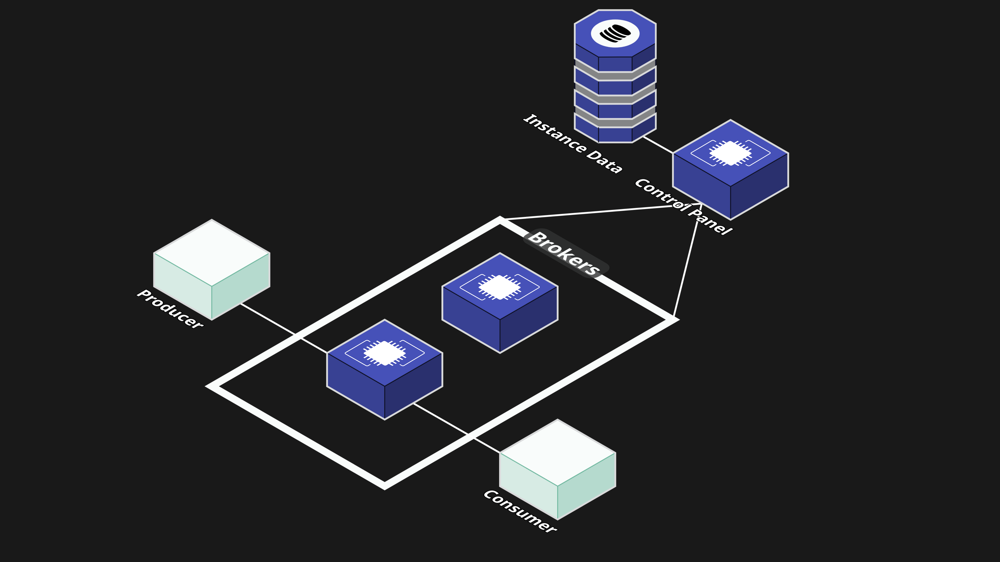
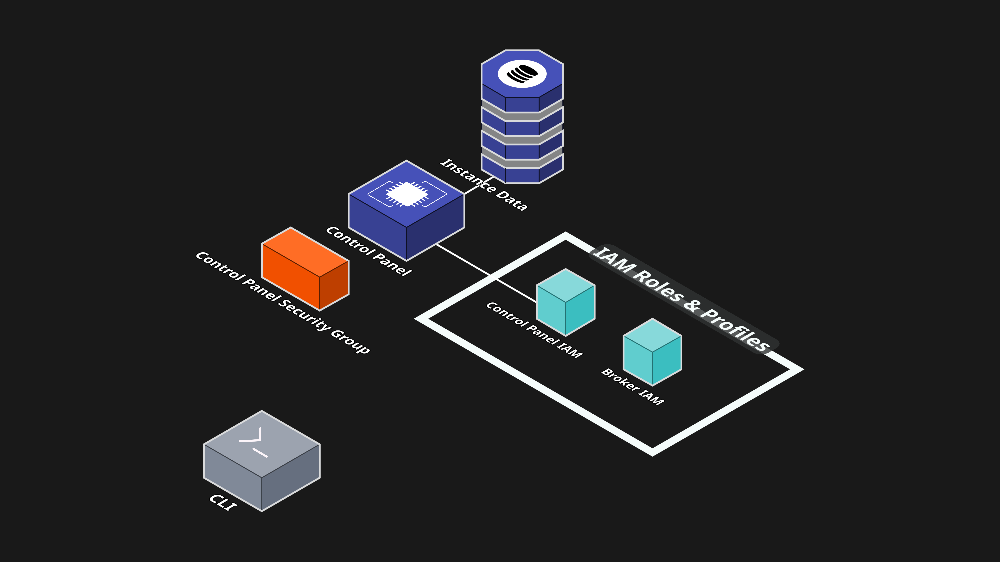

# Architecture Overview

Rabbitory follows a modular, self-hosted architecture deployed entirely within the user’s AWS account. The system is composed of four main components:

1. CLI Tool (NPM package)

2. Control Panel (EC2 Instance)

3. RabbitMQ Nodes (EC2 Instances)

4. Metadata Store (DynamoDB)



Below, we’ll explore each of these architectural components in depth to showcase how Rabbitory is structured and how each part contributes to its overall functionality.

## Command-Line Tool

The Rabbitory command-line interface (CLI) is a globally installed npm package that serves as the entry point to the entire Rabbitory system. After installation, users can run a single command to deploy or destroy all the AWS infrastructure needed to run the Control Panel and manage RabbitMQ instances. Deployment requires only an AWS region and, optionally, a custom domain for HTTPS. If a custom domain is provided, the CLI also configures DNS and automatically sets up an SSL certificate using Let's Encrypt, enabling secure HTTPS access.

Running `rabbitory deploy` provisions the following core infrastructure:

- A t3.small EC2 instance running Ubuntu to host the Control Panel
- A DynamoDB table to store metadata about RabbitMQ instances
- All required IAM roles, instance profiles, and security groups



IAM roles follow the principle of least privilege, granting only the necessary permissions for each instance. Security groups define inbound and outbound rules to ensure each instance communicates only with trusted sources on required ports.

While users can choose instance size and storage for RabbitMQ brokers, the Control Panel instance is fixed. We've selected a t3.small instance for cost-efficiency without sacrificing performance. When users no longer need the infrastructure, the `rabbitory destroy` command cleanly tears down all resources provisioned during deployment, including the DynamoDB table, the Control Panel instance, all managed RabbitMQ broker instances, and supporting AWS resources.

## The Control Panel

The Rabbitory Control Panel communicates directly with all RabbitMQ instances to handle creating new instances, making configuration changes, and performing deletions. Rabbitory is hosted on a t3.small EC2 instance, chosen to give developers more control over their infrastructure at a lower price point. Hosting the Control Panel on an EC2 allows for custom IAM roles, security groups, and cohesive communication with other RabbitMQ EC2s in the Rabbitory environment.

The Control Panel is built entirely with Next.js, which powers both the backend server and the frontend UI, while Tailwind CSS is used for styling. Using Next.js allowed the entire app to run on a single EC2 instance, instead of relying on separate static file hosting services like AWS S3 Bucket. Static file hosting refers to the practice of serving pre-built, unchanging content such as HTML, CSS, JavaScript, and images directly from a storage service. S3 is a popular choice for static hosting because it stores and makes these files accessible over the web. However, with Next.js, we can serve dynamic content, handle server-side rendering, and manage API requests all from a single EC2 instance. This simplifies deployment and enables the Control Panel to be more integrated and responsive.

## RabbitMQ Nodes

Once the Control Panel is deployed, users can create individual RabbitMQ instances, each running on its own dedicated EC2 instance. During creation, users choose the instance type and storage size, allowing them to scale each broker according to its expected workload. Each instance is provisioned with an IAM role for permissions and a dedicated security group to control its network access.

After deployment, the Control Panel displays the instance’s AMQP endpoint under General > Instance Info. This endpoint is what users plug into their producer or consumer code when building queue logic. Each instance can also be configured independently, with support for custom plugins, configuration files, and firewall settings tailored to its specific use case.
For JavaScript applications, a typical connection might look like this:

```javascript
amqp.connect(`amqp://${username}:${password}@${endpoint}`, ...)
```

## Metadata Store

Rabbitory uses DynamoDB to track and persist metadata about each RabbitMQ instance. This metadata allows the Control Panel to accurately reflect the state and configuration of each RabbitMQ instance, even if the instance is restarted or recreated. For every instance created, DynamoDB stores key data such as:

- Instance ID: A unique identifier for the instance
- Instance Name: The user-defined name
- Encrypted username/password: Credentials for accessing the RabbitMQ Management UI
- Alarms: User-defined memory or storage thresholds
- Backups: Snapshots of RabbitMQ configurations including policies, exchanges, users, permissions, and queues

RabbitMQ instances are not persistent. If the EC2 hosting a RabbitMQ broker goes down, any queued messages are lost, and the instance is assigned a new IP address. However, since the core configuration and plugin data are preserved in DynamoDB, the instance can recover its settings without manual reconfiguration—unless it was terminated. Backups are also stored in DynamoDB and can be created at any time. Users can download these backups through the Control Panel’s Backups page, making it easy to restore the state when needed. In contrast, the Control Panel runs on a persistent EC2 instance and uses PM2 to ensure the app is restarted automatically after a reboot. Thanks to this persistence, the Control Panel can always reconnect to DynamoDB on startup and continue serving accurate data to users.
