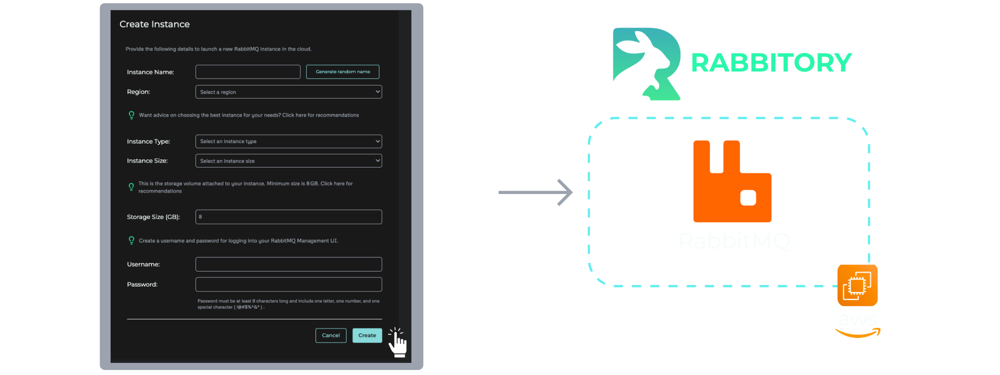

import AnimatedSvgEmbed from '@site/src/components/AnimatedSvgEmbed';

# The Control Panel

The Rabbitory Control Panel enables Rabbitory to function as a RabbitMQ-as-a-Service solution. It provides a centralized interface for provisioning, configuring, and managing RabbitMQ instances, as well as the underlying EC2 infrastructure of each instance. Designed for flexibility and ease of use, the Control Panel streamlines complex server management tasks into a smooth and accessible user experience. Here are the key features:

## One-Click Provisioning

Setting up a RabbitMQ server on EC2 usually takes time and experience. Developers need to choose the right AMI, configure IAM roles, set up security groups, write a startup script, install RabbitMQ, enable plugins, and handle configuration manually. Even with solid AWS knowledge, provisioning an EC2 instance with RabbitMQ is a multi-step process that’s prone to errors.

Rabbitory simplifies this process by doing all the manual work for its users. With one-click provisioning, users can spin up a new RabbitMQ instance in seconds. After entering a few details, the system launches an EC2 instance with RabbitMQ already installed and configured. Rabbitory fetches a region-specific Ubuntu AMI, assigns an IAM role, and sets up security groups. Then, a custom startup script handles the rest by installing RabbitMQ, enabling plugins, writing the config file, and creating a management user.

## RabbitMQ Plugins, Configurations, and Backups

Without a tool like Rabbitory, managing RabbitMQ settings means SSHing into your server, editing config files by hand, and restarting the broker manually. It’s tedious, error-prone, and hard to scale.

Rabbitory simplifies all of this manual work. Through the Control Panel, users can enable a wide range of plugins and update all RabbitMQ server configurations with just a few clicks. Behind the scenes, these actions are translated into shell commands and run remotely using AWS SSM.

Rabbitory also supports instance-level backups. Backups in Rabbitory are snapshots of RabbitMQ "definitions," which include crucial configuration details like exchanges, queues, bindings, and permissions. Rabbitory backups are exported as JSON files and provide a reliable record of the instance’s configuration for easy restoration when needed. This ensures that environments can be restored or migrated easily.

## Hardware Choice and Updates

Rabbitory allows users to configure the hardware of the RabbitMQ instances, including the EC2 instance type and disk space. This flexibility tailors RabbitMQ to meet the specific performance and reliability needs of the queue’s traffic demands. Rabbitory balances this flexibility by setting common defaults on the RabbitMQ server, and by providing helpful recommendations and links to external documentation where appropriate. This approach supports a wide range of workflows and accommodates users with advanced configuration needs.

## Firewall Settings

To protect RabbitMQ instances from unwanted network access, each one is secured behind a dedicated firewall.

<AnimatedSvgEmbed svgName="firewall.svg" altText="Firewall Demonstration" />

In AWS, firewalls are implemented using security groups, which act as virtual firewalls. Rabbitory creates a unique security group for each RabbitMQ instance with a name that corresponds to the instance’s name. This provides users with precise control over the inbound and outbound traffic of each RabbitMQ broker instance.

Alongside a robust set of features, RabbitMQ offers the following message queuing protocols: AMQP, MQTT, STOMP, and STREAM. By default, RabbitMQ uses plugins to enable these protocols. Since these protocols require dedicated ports, it’s crucial to not only enable the corresponding protocol plugin but to also open up the corresponding port on the instance’s security group when enabling any of these protocols. Rabbitory’s Firewall page, available for each instance, allows developers to easily configure both AWS security group rules and RabbitMQ ports in one place.

## Monitoring with Alarms and Logs

Rabbitory integrates monitoring features that help users track the health and performance of RabbitMQ instances. From the Control Panel, users can view logs, configure alarms, and receive alerts based on specific thresholds or failure conditions.

A dedicated Logs page displays logs from the EC2 instance running RabbitMQ. These logs are fetched using AWS SSM and are useful for debugging broker-level issues without requiring manual SSH access. The page is designed for readability, with timestamps and scrollable output for easier troubleshooting.

In addition to log monitoring, users can configure alarm conditions and receive real-time notifications. Alerts are delivered through a Slack bot that users set up during onboarding, making it easy to integrate Rabbitory into existing incident workflows. This visibility ensures that any potential issue, such as memory pressure, queue build-up, or connection timeouts, can be identified and addressed promptly.

## Badge Notifications for All Updates

Rabbitory incorporates badge notifications that alert users to all significant RabbitMQ instance events. This includes updates on provisioning status, configuration changes, and other system events. As changes are made to RabbitMQ server or the EC2 instance, the Control Panel gives real-time feedback to users, ensuring they are always up-to-date on the status of their infrastructure.
