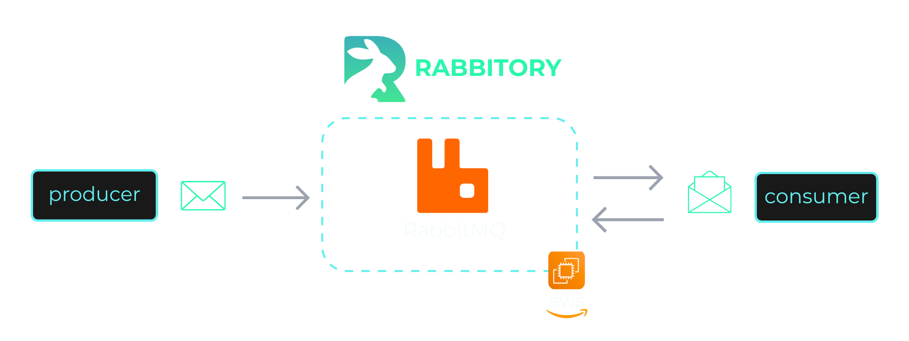

# Introduction

Rabbitory is an open-source, self-hosted message queue management tool built specifically for RabbitMQ, one of the most widely used message brokers in modern software systems. It streamlines the deployment, configuration, and control of RabbitMQ instances and hosts the platform on the cloud through AWS.

In the broader managed message queue ecosystem, Rabbitory fills a critical niche. Above all, Rabbitory prioritizes infrastructure ownership and simplicity of use. It's ideal for small to medium-sized teams that want the power of RabbitMQ without the headache of managing it alone.

The following document dives into how and why Rabbitory was built. It provides context on message queues and RabbitMQ, explains how Rabbitory fits in to the managed message queue space, and outlines the technical decisions that shaped how Rabbitory was designed.
