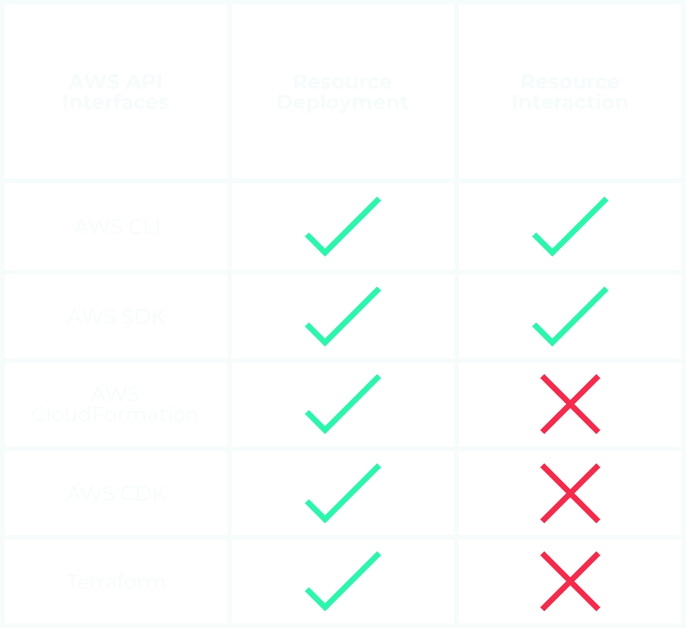
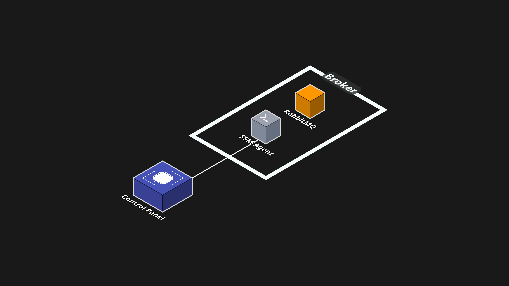

# Technical Decisions & Challenges

Automating the AWS Cloud infrastructure and designing the Control Panel for Rabbitory came with its own set of unique considerations and challenges. Below is a summary of the most salient decisions we made as a team and what challenges we encountered in building this tool.

## AWS EC2 vs ECS

The first technical decision our team needed to make was on whether to host RabbitMQ servers in containers managed by ECS (Elastic Container Service) or on EC2 (Elastic Compute Cloud) instances. Choosing the ECS option would make deployments faster and scaling easier by abstracting infrastructure and managing containers for you. However, it would introduce complexity for stateful apps like RabbitMQ, and give developers less direct access to things like storage, networking, and system-level configurations. On the other hand, the EC2 option provides users full control over their servers, making it ideal for managing RabbitMQ’s configuration, plugins, and storage directly. The tradeoff of using EC2 is more manual setup and maintenance, with slower provisioning and scaling as compared to containers.

Rabbitory prioritizes transparency, infrastructure ownership, and simplicity in a single-instance, self-hosted context. EC2 offers the right balance of control and familiarity for users who want to own their setup without diving deep into the complexities of container orchestration. If Rabbitory expands to support RabbitMQ clustering, ECS might become a more compelling option. But for now, the EC2 option best matches Rabbitory’s philosophy and needs.

---

## AWS SDK vs. CDK

When deploying and interacting with AWS cloud resources, developers have the following options:

- AWS Command-Line Interface
- AWS SDK - Software Development Kits
- AWS CloudFormation
- AWS CDK- Cloud Development Kit
- Terraform

All of these options can call the AWS API to deploy resources, while the CLI and SDK can be used for AWS resource interactions. Because we wanted to automate AWS provisioning, our team considered the following two paths:

(1) AWS Typescript SDK for both deployment and resource interactions
(2) AWS Typescript CDK for deployment + SDK for resource interactions

Our team ended up choosing the first option, exclusively using the AWS SDK in our project, for infrastructure flexibility and quicker development. This approach removed the overhead of CloudFormation stacks and CDK bootstrapping, allowing Rabbitory to be both lightweight and customizable. The tradeoffs are that Rabbitory takes on more responsibility for infrastructure modeling, permission management, and avoiding configuration drift.

---

## RabbitMQ Server Interactions

RabbitMQ comes with a large set of utility features that allow users to customize their queues. Allowing users to access and enable these specialized features from a centralized place, like our Control Panel, is essential. To enable these features, users often need to interact with the RabbitMQ server directly. Since the Rabbitory Control Panel runs on a separate EC2 instance than the RabbitMQ EC2 instances, we needed a method for remotely controlling and configuring the RabbitMQ EC2.

One straightforward solution would be to create a custom API on each RabbitMQ instance that would accept requests and execute corresponding actions. However, running a persistent API on each RabbitMQ instance would force the instance to share system resources with other processes. According to RabbitMQ documentation, this is considered poor practice. We quickly recognized the need for an alternative approach that would avoid additional server load on the broker instance.

Another possible solution was to download RabbitMQ’s CLI tools onto the Control Panel EC2 instance to communicate with the RabbitMQ instances. This would allow the Control Panel to perform remote operations on each RabbitMQ instance without compromising the RabbitMQ instances’ system performance. However, this solution would shift the system resource burden onto the Control Panel EC2 and introduce additional dependencies. This method also creates redundancy, as the CLI tools already exist on each RabbitMQ broker instance.

Instead, we wanted a solution that enables remote access to these tools without duplicating infrastructure. AWS SSM Session Manager addressed this need by allowing users to initiate secure, remote shell sessions directly to EC2 instances. Using IAM permissions, users can safely run bash commands on remote instances without the need for persistent APIs or additional dependencies, preserving both performance and system simplicity. In Rabbitory, we utilize AWS SSM to change RabbitMQ configurations, enable plugins, and open protocol ports for individual RabbitMQ instances.

---

## Challenges with the Control Panel

#### AWS EC2 Status Inconsistencies

One challenge encountered when building Rabbitory was showing accurate instance statuses on the Control Panel homepage. AWS marks an EC2 as “running” even when RabbitMQ is still starting up. To fix this, we added a custom check that polls the instance until RabbitMQ is fully ready and its config is saved to DynamoDB. Only then do we mark it as “running.” Until that point, it stays in a “pending” state, and we block access to the instance details page.

#### Badge Notifications

Another challenge came in creating badge notifications for Control Panel events. To build badge notifications for our Control Panel, the application needed a way to deliver real-time alerts to the frontend without requiring a page refresh. While websockets are a common choice for this kind of communication, they require a persistent server to keep the connection open. Since Next.js uses a serverless architecture, this approach wasn't a good fit. Instead, we implemented the system using <a href="https://developer.mozilla.org/en-US/docs/Web/API/Server-sent_events" target="_blank">server-sent events</a>, which work well in a serverless environment and allow for efficient one-way communication from the server to the client.

#### Creating Alarms on a Self-Hosted App

Additionally, creating an Alarms Page for a self-hosted platform came with some unforeseen tradeoffs. For the Alarms Page, we wanted to allow users to integrate memory and storage alarms within their team’s workplace Slack. However, since Rabbitory is self-hosted, it couldn’t rely on a centralized Slack bot to send alerts to users.

To solve this problem, we chose to provide users a way to easily create their own Slack bot. On the Alarms Page, a quick tutorial is provided to guide users in creating a Rabbitory Slack bot for their alarms. Although this adds manual work for users, this approach aligns with Rabbitory’s self-hosted model and allows users the convenience of receiving a Slack notification when memory and storage issues arise. Right now, Rabbitory alarms run with <a href="https://www.npmjs.com/package/node-cron" target="_blank">node-cron</a> on the Control Panel’s EC2 instance. In the future, we’re considering <a href="https://aws.amazon.com/eventbridge/" target="_blank">AWS EventBridge</a> to make alarms more reliable and decoupled.

---

## Automating HTTPS

Unlike Rabbitory, many self-hosted SaaS tools don’t enable HTTPS by default, placing the responsibility of enabling HTTPS on the user. While this simplifies initial deployment, it requires users to manually secure their application later.

For example, Grafana, an open-source tool for monitoring and visualizing time-series data, ships with HTTP by default and leaves <a href="https://grafana.com/docs/grafana/latest/setup-grafana/set-up-https/" target="_blank">HTTPS setup</a> to the user. This usually means configuring DNS, installing SSL certificates, and setting up a reverse proxy like NGINX. Each step depends on the one before it, and DNS propagation can be slow or inconsistent depending on the domain provider.

Rabbitory takes a different approach. Our team automated HTTPS setup to cut down on deployment overhead. When users choose to deploy the Control Panel with HTTPS, the CLI asks for a domain the user owns, then handles the rest. It updates DNS using Route53, whether the domain is registered there or elsewhere. It sets up a hosted zone, adds A-records for the Control Panel, issues certificates with Certbot, and configures NGINX as a reverse proxy. By automating this setup, Rabbitory provides a secure, production-ready environment with minimal manual effort.

[ CLI image of this here ? ]
