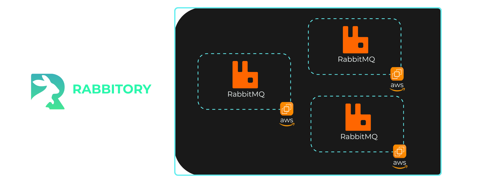
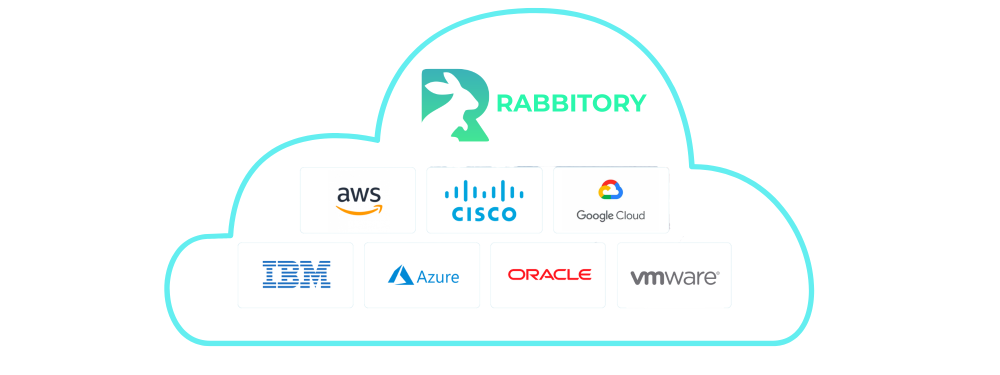

# Future Work

While Rabbitory is already a robust solution, there is always room for growth. Below are some of the features and enhancements we plan to explore in future updates:

### Control Panel Login

Currently, the Control Panel has no login system. After deploying Rabbitory through the custom CLI tool, users receive a URL endpoint to their Control Panel and can directly access it through this URL. This avoids the need for credential storage and recovery, which helps reduce bugs and maintenance overhead related to authentication.

However, since the URL is the only layer of security, it’s important to keep it private to avoid unintended access. Adding a login system in the future would provide an additional layer of protection by requiring user authentication before access is granted.

### RabbitMQ Clustering Support

A cluster in RabbitMQ is a group of one or more RabbitMQ server nodes that behave as a single logical broker. This provides higher availability, better load balancing of incoming messages, and overall improved scalability to the message queue infrastructure. Creating and managing clusters is complex. It involves binding ports across nodes, creating quorum queues, and automatically handling failover of nodes.

AmazonMQ provides limited support for clustering, as it handles quorum queues and auto-failover but does not handle other RabbitMQ clustering features such as classic mirrored queues, custom cluster configuration, or cluster scaling. On the other hand, CloudAMQP fully manages RabbitMQ clustering, which means it can support all of the available features of RabbitMQ clustering.

Future work for Rabbitory would include integrating cluster support for managed RabbitMQ instances. First steps would be to allow users to create a cluster with a simple interface that manages setup and port bindings behind the scenes. From there, Rabbitory would increase its clustering support to eventually match that of CloudAMQP. Since clustering is such a unique, useful feature of RabbitMQ, it would be an impressive addition to be able to manage this feature through Rabbitory.

### Additional Cloud Platforms

Some managed message broker services offer the ability to deploy RabbitMQ instances on cloud platforms other than AWS. Common cloud platforms besides AWS include Google Cloud Platform (GCP), Azure, Digital Ocean, IBM Cloud, and Oracle. Adding another cloud platform to Rabbitory would expand our potential user base and provide users with more choice, which is an important philosophy for Rabbitory.

To build this feature, Rabbitory would expand its availability to other cloud platforms one at a time. This would involve deploying the appropriate resources for that cloud platform and creating an updated Control Panel for that platform’s specifications. Currently, Rabbitory uses the AWS Typescript SDK to deploy and interact with AWS cloud resources.

Adding a second cloud platform would encourage a transition from SDK-based deployment to Terraform-based deployment, as Terraform offers an interface for deploying cloud resources across multiple platforms.
