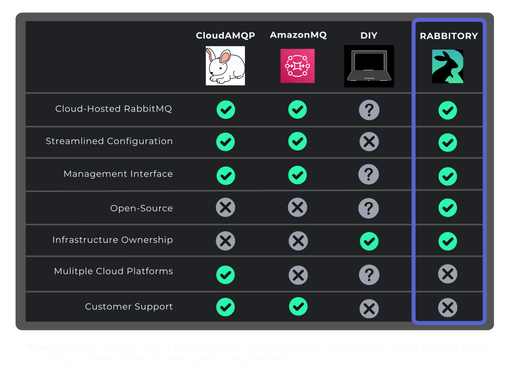
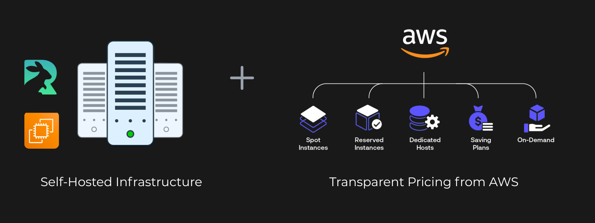

# Meet Rabbitory

Most teams face a tradeoff when managing RabbitMQ: DIY setups demand too much time and expertise, while commercial platforms offer too little control over infrastructure.

This is where Rabbitory steps in.

Rabbitory is a self-hosted, RabbitMQ-as-a-Service platform that offers the simplicity of a managed message broker solution with the control and flexibility of a DIY setup.

## Rabbitory vs. Existing Solutions

## Infrastructure Ownership

Rabbitory is built for developers on small to mid-sized teams who want the convenience of a managed RabbitMQ without giving up control of their infrastructure.
The Rabbitory Control Panel is self-hosted, which gives users full ownership of the RabbitMQ instances they deploy. Unlike with CloudAMQP or AmazonMQ, where the provider controls the infrastructure, Rabbitory provisions everything in the user's own AWS account. Users have root access to their EC2 instances, direct control over their environment, and full visibility into their system.

Additionally, when creating a new instance, users choose the EC2 type and storage size that best match their needs. The Control Panel provides helpful hardware recommendations based on throughput and expected message size, but users ultimately remain in control of their hardware.

One key benefit of Rabbitory’s self-hosted model is transparent pricing. Rabbitory costs reflect standard AWS <a href="https://aws.amazon.com/ec2/pricing/on-demand/" target="_blank">EC2</a> and <a href="https://aws.amazon.com/dynamodb/pricing/?utm_source=chatgpt.com" target="_blank">DynamoDB</a> pricing models, so users can accurately predict their platform costs.

Overall, this emphasis on owning your managed message broker infrastructure provides users with greater control, smoother integration with existing AWS setups, and transparent operational costs.

## Custom Command-Line Interface

To simplify self-hosting, Rabbitory offers a custom CLI tool to deploy the base infrastructure of the managed RabbitMQ platform. The Rabbitory CLI is an <a href="https://www.npmjs.com/package/rabbitory_cli" target="_blank">npm package</a> that interacts with the configurations preset in each user’s AWS CLI environment. Further, it automates the provisioning of all necessary AWS resources, including IAM roles, policy permissions, security groups, and the primary EC2 and DynamoDB servers so that the Rabbitory infrastructure works seamlessly after deployment.

## Managing RabbitMQ – So You Don’t Have To

Like other managed message broker services, Rabbitory’s core purpose is to help users easily create and manage their RabbitMQ instances. This is done through a web-based Control Panel, which is hosted on its own EC2 instance. The Rabbitory Control Panel lets developers quickly create preset instances of RabbitMQ, complete with the most important plugins and features. Once created, developers can view instance information, access the RabbitMQ management plugin, configure settings, and monitor their instance with logs and alarms.
